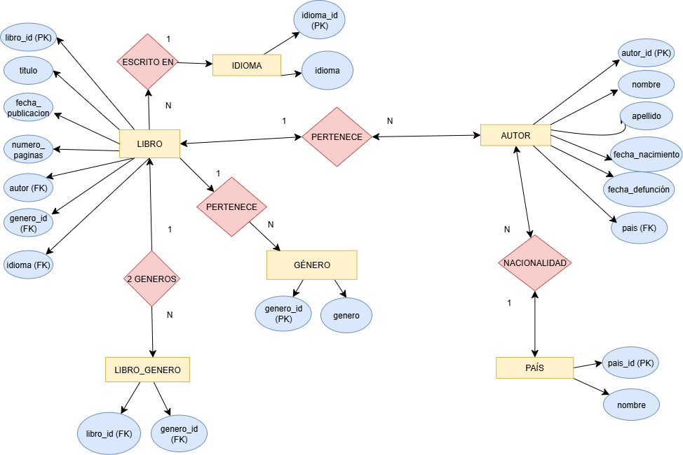
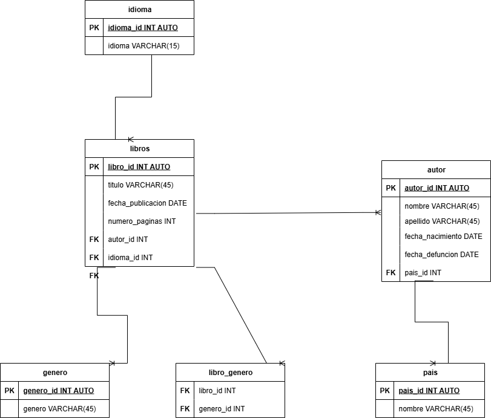

# Libros

## Listado de entidades

### Libro (ED)
- libro_id **(PK)**
- titulo
- fecha_publicacion
- numero_paginas
- genero **(FK)**
- autor **(FK)**
- idioma **(FK)**

### Libro_Genero (EP)
- libro_id **(FK)**
- genero_id **(FK)**

### Autor (ED)
- autor_id **(PK)**
- nombre
- apellido
- fecha_nacimiento
- fecha_defuncion
- pais **(FK)**

### Género (EC)
- genero_id **(PK)**
- genero

### Idioma (EC)
- idioma_id **(PK)**
- idioma

### Pais (EC)
- pais_id **(PK)**
- pais

## Relaciones

1. Un **libro** _es escrito_ por un **autor**. [_N a 1_]

1. Un **autor**  _pertenece_ a un **país**. [_N a 1_]

1. A un **autor** le _pertenecen_ muchos libros. [_1 a N_]

1. Un **libro** _puede tener_ varios géneros. [_N a M_]

## DIAGRAMAS

### Modelo Entidad - Relación

### Modelo Relacional de la BBDD

## Reglas de Negocio

Operaciones CRUD (Create, Read, Update, Delete)

### Libro

1. Crear el registro de un libro.
2. Leer el registro de un libro dada una condición en particular.
2. Leer todos los registros de la entidad libros.
2. Actualizar los datos de un libro dada una condición en particular.
3. Eliminar los datos de un libro dada una condición en particular.

### Autor

1. Crear el registro de un autor.
2. Leer el registro de un autor dada una condición en particular.
2. Leer todos los registros de la entidad autor.
2. Actualizar los datos de un autor dada una condición en particular.
3. Eliminar los datos de un autor dada una condición en particular.

### genero

1. Crear el registro de un genero.
2. Leer el registro de un genero dada una condición en particular.
2. Leer todos los registros de la entidad genero.
2. Actualizar los datos de un genero dada una condición en particular.
3. Eliminar los datos de un genero dada una condición en particular.

### pais

1. Crear el registro de un pais.
2. Leer el registro de un pais dada una condición en particular.
2. Leer todos los registros de la entidad pais.
2. Actualizar los datos de un pais dada una condición en particular.
3. Eliminar los datos de un pais dada una condición en particular.

### idioma

1. Crear el registro de un idioma.
2. Leer el registro de un idioma dada una condición en particular.
2. Leer todos los registros de la entidad idioma.
2. Actualizar los datos de un idioma dada una condición en particular.
3. Eliminar los datos de un idioma dada una condición en particular.