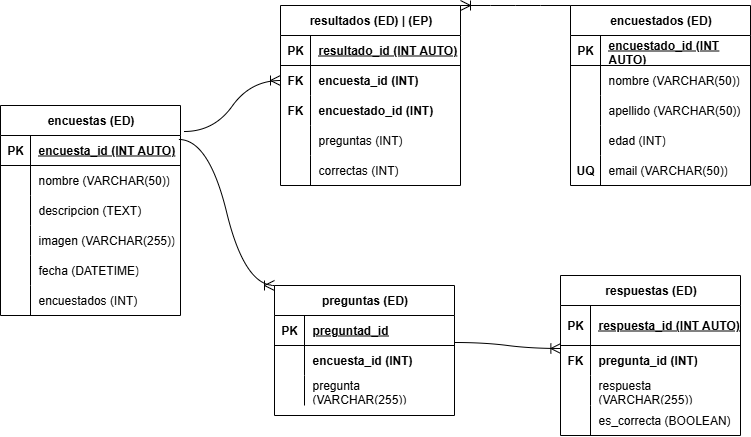

# Sistema de encuestas

## Listado de entidades

### Encuestas **(ED)**

- encuesta_id **(PK)**
- nombre
- descripcion
- imagen
- fecha
- encuestados

### preguntas **(ED)**

- pregunta_id **(PK)**
- encuesta_id **(FK)**
- pregunta

### respuestas **(ED)**

- respuesta_id **(PK)**
- pregunta_id **(FK)**
- respuesta
- es_correcta

### encuestados **(ED)**

- encuestado_id **(PK)**
- nombre
- apellidos
- edad
- email **(UNIQUE)**

### resultado **(ED)|(EP)**

- resultado_id **(PK)**
- encuesta_id **(FK)**
- encuestado_id **(FK)**
- preguntas
- correctas

## Relaciones

1. Una **encuesta** tiene **preguntas** (_1 - M_).
1. Una **pregunta** obtiene **respuestas** (_1 - M_).
1. Una **encuesta** obtiene **resultados** (_1 - M_).
1. Un **encuestado** tiene **resultados** (_1 - M_).

## Modelo relacional del Sistema de Encuestas

## Reglas de negocio

